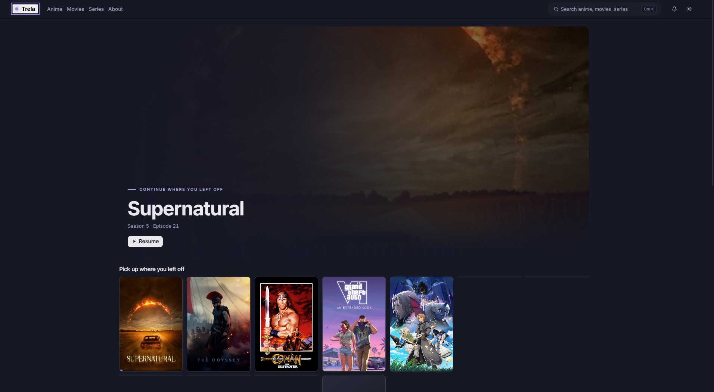
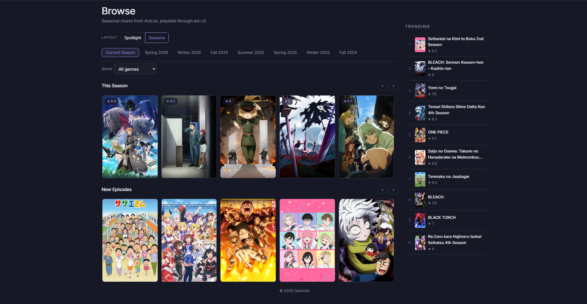
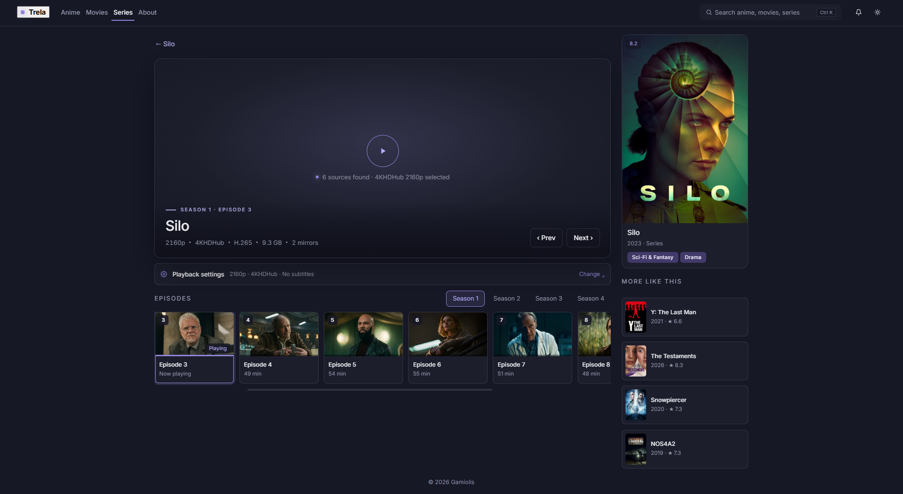

# Trela

A Tauri desktop app for browsing and watching anime, movies and series. Trela
handles discovery and metadata itself (AniList for anime, TMDB for movies/series)
and hands playback off to **mpv**, launched via **ani-cli** for anime and
**MovieBox** / **4KHDHub** resolvers for movies and series — the app is a
browser and launcher, not a video player.

## Screenshots

<!-- Drop your own screenshots into docs/screenshots/ with these filenames,
     or update the paths below to match whatever you save. -->

| Home | Browse |
| --- | --- |
|  |  |

| Watching — Anime | Watching — Series |
| --- | --- |
|  |  |

## Features

- **Anime** — seasonal charts, trending, genre filters, and recommendations
  from AniList; playback resolved and launched through `ani-cli` with a
  Best/1080p/720p/480p/360p/Worst quality picker.
- **Movies & Series** — search, genre/year discovery, and trending from TMDB;
  streaming sources merged from **MovieBox** and **4KHDHub** into one list,
  sorted by quality and mirror count, with a language picker and a
  Download-and-play fallback for sources that won't stream reliably.
- **Watching page** — a main panel + sidebar layout: launch status, live
  playback settings (quality, source, language, subtitles), a horizontal
  episode strip for jumping between episodes without leaving the page, and
  "More like this" recommendations.
- **Continue Watching** — resumes exactly where mpv left off, anime, movies
  and series alike, with a progress bar on the Home page.
- **Wishlist & notifications** — track titles and get notified when a
  tracked anime/series has new episodes or a wishlisted movie releases.
- **Light/dark theme**, a command palette (`Ctrl+K`), and a backup/restore
  export for your wishlist, continue-watching list, and preferences.

## Tech stack

- [Tauri 2](https://tauri.app/) (Rust backend, vanilla HTML/CSS/JS frontend —
  no bundler, no framework)
- [ani-cli](https://github.com/pystardust/ani-cli) for anime resolution/playback
- [moviebox-tui](https://crates.io/crates/moviebox-tui) for MovieBox/4KHDHub
  resolution
- [mpv](https://mpv.io/) as the actual video player, launched externally
- [AniList](https://anilist.co/) and [TMDB](https://www.themoviedb.org/) APIs
  for metadata

## Getting started

### Windows — guided install

```powershell
.\scripts\install-windows.ps1
```

Checks for Git, Scoop, `ani-cli`, `moviebox-tui`, and the Rust toolchain;
installs what's missing (asking before any system change); then builds and
runs the app. See `installer/packages.json` for the package IDs it installs
from.

### Manual setup

Prerequisites:

- [Rust](https://www.rust-lang.org/tools/install) and the
  [Tauri CLI](https://tauri.app/start/prerequisites/)
- [`ani-cli`](https://github.com/pystardust/ani-cli) and
  [`moviebox-tui`](https://crates.io/crates/moviebox-tui) on your `PATH`
- [`mpv`](https://mpv.io/installation/)

```bash
cargo tauri dev
```

### TMDB API key

Movies and Series need a free TMDB API key (themoviedb.org → Settings → API,
no cost, no card) — enter it under **About** in the app once it's running.
Anime works with no key at all.

## Development

`src/index.html`, `src/js/*.js`, and `src/styles.css` are plain static files —
no build step, no bundler. The Rust/Tauri backend lives in `src-tauri/src`.
Run `cargo tauri dev` to launch with hot-reload on the frontend files.

## Building a release

```bash
cargo tauri build
```
